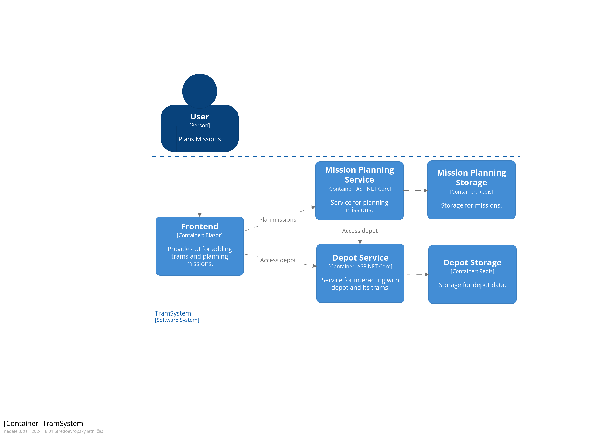
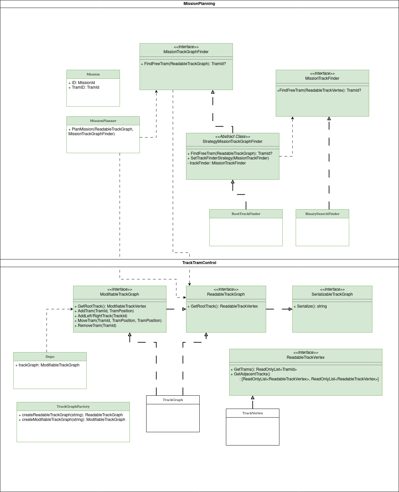
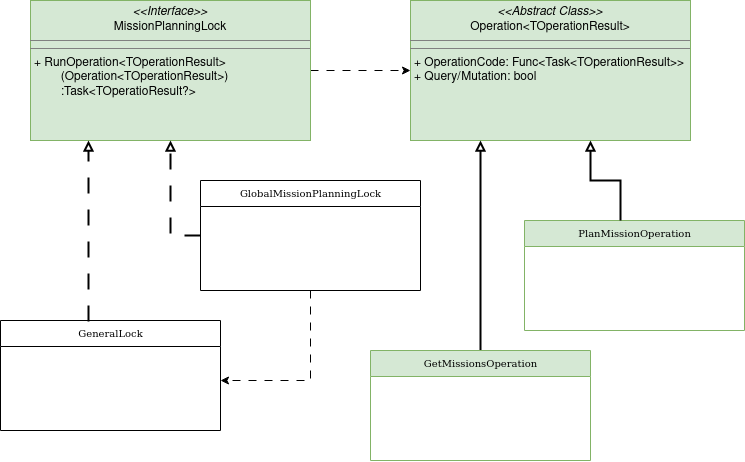

# Tram System
V ramci readme nejdrive strucne popisuji implementaci. Dole pak jsou instrukce pro spusteni a nejake napady pro zlepseni implementace.
## Implementace

### Architektura
Na obrazku dole je videt architektura vypracovaneho reseni ukolu. Jedna se o kontejnerovy pohled v ramci C4 modelu. Kazdy obdelnik zde reprezentuje kontejner, ktery ma v C4 modelu vyznam runtime komponenty - samostatne spustitelny "program"/sluzba. Frontend kontejner je UI aplikace, se kterou interaguje uzivatel pri planovani misi. Pro business logiku frontend vola bud sluzbu Depot Service nebo Mission Planning Service pomoci HTTP. Depot Service ma za ukol spravovat layout koleji v depu a umisteni tramvaji na kolejich. Mission Planning Service ma za ukol planovat mise pro tramvaje v depu. Kazdy z techto kontejneru/servisu uklada data do vlastni databaze.



### Tech stack
Frontend je naprogramovany pomoci Blazoru. Runtime sluzby (Depot Service, Mission Planning Service) jsou implementovany v ASP.NET core. Pro perstitenci dat sluzeb se pro jednoduchost pouziva Redis v obou pripadech.

## UML Modely
Pro detailnejsi predstavu, jak moje reseni funguje prikladam strucne okomentovane UML diagramy reprezentuji hlavni tridy v kodu. Zelene podbarveni v diagramu znamena, ze to je soucast rozhrani, ktere se pouziva "z venku" (napr. v endpoint controlleru). V celem problemu jsem odhalil 2 hlavni domeny (resp. 3 - treti je zamkovy mechanismus).

Prvni domena (TrackTramControl) se zabyva rozlozenim koleji v depu a umistenim tramvaji na koleje. V ramci UML diagramu dole je to ta spodni cast. V ramci zadani sice tramvaje mohou byt za sebou jen na jedne koleji, nicmene jsem se rozhodl udelat rozhrani tak, abych mohl reprezentovat spojene koleje pomoci vyhybek. Vrchol grafu (Track Vertex) reprezentuje usek koleje, ktera neobsahuje zadnou vyhybku. Vrchol pak obsahuje hrany do dalsich vrcholu, pokud je s nimi spojen vyhybkou ("nalevo" nebo "napravo"). Kazdy vrchol (kolej) pak obsahuje seznam tramvaji, ktere se na nem vyskytuji. 

Myslenka rozhrani pro takovy graf (ModifiableTrackGraph, ReadableTrackGraph) je, ze by pak mohlo umoznovat umistovat tramvaje na koleje, presouvat je z koleje na kolej, pridavat koleje etc - implementace by pak mohla kontrolovat, zda je to realne mozne. Pro jednoduchost jsem implementoval jen metody pro pridani tramvaji a koleji.

Druha domena (Mission Planning) se pak zabyva samotnym planovanim misi. V ramci UML diagramu dole je to ta horni cast. Vyuziva uz zmineny graf koleji (a tramvaji) a hleda "nejvhodnejsi tram bez mise", ktere by naplanovala misi - rozhrani MissionTrackGraphFinder. Dale je tu rozhrani pro hledani vhodne tramvaje v ramci jedne koleje - MissionTrackFinder.

Trida RootTrackFinder pak hleda vhodnou tramvaj bez mise jen na jedne koleji dle zadani a neresi cely zbytek grafu.

Pokud nejsou modely dostatecne videt je mozne nahlednout do [Drawio Vieweru pro prvni 2 domeny](https://viewer.diagrams.net/?tags=%7B%7D&lightbox=1&highlight=0000ff&edit=_blank&layers=1&nav=1&title=trams.drawio#R%3Cmxfile%3E%3Cdiagram%20name%3D%22Page-1%22%20id%3D%22c4acf3e9-155e-7222-9cf6-157b1a14988f%22%3E7V1bc5s4GP01nkkf3AEBNn6M7abb3XQ2k2z39iYb2VaLkReUi%2FvrVwIJgxD4BrZbk%2FEklhBC%2BnR0vosk0rFGy7ePIVwtPhMP%2BR1geG8da9wBwDKcHvvDc9ZJDrCAkeTMQ%2BwleeYm4wl%2FRyJTFnvGHopyBSkhPsWrfOaUBAGa0lweDEPymi82I37%2BqSs4R4WMpyn0i7l%2FYY8uklzXMTb5vyA8X8gnm4a4MoHTb%2FOQPAfieQEJUHJlCWU1omi0gB55zWRZHzrWKCSEJt%2BWbyPkc7lKiSX33ZVcTZscooDucsMIPvzmgP%2B%2B%2F%2Fvly%2BJXsLQ%2Ff%2F0bdEUtEV1LUSCPSUYkSUgXZE4C6H%2FY5A7j7iJeq8FSmzL3hKxYpskyvyJK12KY4TMlLGtBl764igLvlg8aS058Mv2WZN1h3xd1ejBaxA8wReIBUorCgOfw5rJf1jCiIfmWDhfPSfrCO1AqItlf8hxOZak%2BnE6g07dd5FiD3qQrB4zCcI7EfY4HzIEz8VzDgzPTNLummw4hmxaILBEN1%2BymEPmQ4pd8C6CA5zwtJ25lYoDrTIEVwQGNMjU%2F8AxWQEw10BNtExOtayljrpS3rMry7EvSApnKdGWTFeOoBIRlsnuB%2FrOQwR8hmyMxcRSwFr3ipQ8DlIfHjARUIpCjYbrAvncP1%2BSZD0ZEWXUyNVyQEH9n5aG8mV0OqUAe6PHaGKxGxCchy4hnZ%2FamJ16ZeEyIInbbgwSLmWbdw4jKphDfh6sIT%2BLG8SJLBhIcDAmlZCkKyV7dZZ7cAdYs%2FinMn5QWkvqXeCq%2B%2B3CC%2FGHKL0of8uiXYruDS%2Bzzsf4ThR4MoJRmIg%2BTVwt9POcTacq6icJ01mgmyQsKKXrLZBXRLq86eZiZEnavGzI1JXQXeSItnyEZlFaCsGRu5kDYAT2f42WVA2Dvv2fOvmIQO9atsXpLk13K6ezWjrOYIGhXiO42IzpZA%2Fs2F3%2Fj5%2BBMBlyu%2BHAWU594NTPIiEhm52%2FJ1cikgNWnTEKZ84igBxkqs5NNLZOpaaXmLUIuGKmXZa%2FM8g7ufcM%2BkvfRjKai11XJPsZHRB%2BZ8ox7fPOOFWd5OTH8meB3Rzko1MTBj5mBcCumSwyGdPIkDRwSVmrmx7N3Fmuv3GwD6qT8BfkviNea57um%2BCBPP56DXM9OS2auuGBi9Xr1MAHoKwoHGEUqALaOCuwaqEBr44CrYwNmoeMZbvnAUASRZwRdv2tv1a3nsUcvb%2FivT14HMAgb%2FPsDiTDFJHh36tbc83Lg7pHPvERW8e9P3rv9EFJ72z4zNq0U1bmF94iW%2BSae7vGtwqpQWAXtpNFhpQqru5PCck%2BqsKzWKa9S5Cfwy4uON1A8HEcZ%2FKTx4q4Kj9xUPHjVAUo6V6jnAN9cK0Jb755Lxdj65w3S21H%2B%2BVEkZw0U0PWLHNecf64F4pW76Pv5pj%2ByTc5NpSjrn%2F8e%2BOt7zKZsTtDS6NPJNSseUeut9xXyMY6Fyas%2FrSUWrWCgrfV1gSnqsstckfEer0JUVhPjnEF%2ByJNqRYH49o4zLJeZHlE5AY4qhb69Amfcxk9OaY7ahmKOmkWmtrVM3Zg1KltwzeboTmtE5TZr%2FeaoihLrQGvUVisCu9mj%2By5cma7yoC0LV6Y6D2peuNIjvV0NrfQatoK9Gd9rcKCrBZwTgdvu653DsoZtKd8QuK8vDP6EQsya9%2F3KAuGy20ha3YwbcDBvzbbmzDZHcbAvYdnLtFttVro1YKsqM5sx3EwVKGqA5eKUm1PwSNR9Znve0Ix6A%2F1zoL0CzAxohluvGWYOiuC9lI1pxY1m1SgBRYfgBCixnIIR9BlHESbBgw%2BDINaS5THwOLjzlMR2xq%2FMlsiDYUle4CbwHMems2lCIc2kPeSjbBp5OJvk3JkiU2x7zVyuQWd1QZGLekWtZaaqLKu2%2Bm5TagsMKoeImZjnXqXIWhXtUkUns1RxpI1VMWXLNxwp2sZyNIYX0BlejS1tSCrMeVrcMOcAFli%2B0W3Y48FacX2TfYfZCIfvCqjnzlce8Xnpi8HVLK8p1rze5OchbEaH8W4Ra2xvch6FCO0SQsw4BwvseShQuI8DR2gT1g9nyD5MXiPjvRMHm0csbW7S7MOLh3REAtY%2FiGOsIDaNXlFEjwJWQjRFYMkzDL3dcNS3m7Lfi0T4szvsJeD%2F6T123s27ECV7i4rMINx4sURm3Z14satd%2BaknhHCIerPVfSeanfWn3p10lih5PZ5WpVOw1f%2BSst8ePChRLUcGD%2FqKrVMwYXYNHjiKt%2Baou5kaCozbYp2q2UiA9WPozdsJN2imXFwjH0ZRDfFuVh9F83WrRi9LjSZB%2BWSvSjIUcqRuskOVWvonaVaXE9nmsWK%2FfKE5ra1xNbaGo2xNtc%2B%2FExpc2xrGcQaKVH3nMlBcFUGH7pJWK9p1m%2FS%2BBopqUVluddS6Z1eWb8igKQat04NOkqTbkGgbEk1Bqlj3PZ3PeNqQKAAtj%2B%2FD486OPJ4Qfv2r1MbAeG84rgssBwxs0%2BznAaUuNe%2B83VBdtbZ6x%2FJ63QdkzCLZXqT32FDU9Ro8xXI3MdkCX%2BYntr7J%2BXwT1yoxCM%2Fom7jn0GmXEAfd3c0oGdRLiYOa6rZ0R93WUJOf4SrPkYHRZnf89gqqbIgDGK6fEAyni9Z1aF2HAs0OtrsOJz4oap6FZn9Y10FO%2BnNxs60wnWscyM2O4ir01GMgNVHzQIG8Y1eHgLaUb4bKbVCgcmG1t%2Fzd8vcGnOpuOJ2ZfGL%2BtsuXYz38kl8k%2BzTOLUPF58HLXa%2Fc7SU1xk7cOOfQ7V7Brs9WZmC7M%2B%2FInXkJ2%2B2zM0%2BL6cZ25kmXMgfpi3QFmZzD9d%2FiEXHiH554DxyZHr9lr47XIrWDnbLzW3tOd2pB4ynm6LDbO9QaKdRkNuQpFl5HteW0DVBPcO99g9lzmjdgrJIXD3FOZgTC%2BNGvsmS2nLzYiWr2PQ2RhpO2H4ZQUVXfXrvia3LGaEVao%2B%2B6jD67ErrKhNbh9tQnIHRb17k5RjenHXTv59S%2FJby1p460p6wS5XopJx3sEuWQ7F2EU0rEQ1rKaykvsR%2BVcLomTGlpT9urK9f1YVi3bswpbxoiSFFxN%2BpN8lYG3YvLS19TsalPR5z5GltqPYmrWoLTcmrV4rI5ajU1sLxIV7VTn8dp7fqSh5I4w5FOZ9dUF6sPXp5UXZKGzml01X%2FgkXbhQKeQJTf%2F2CgpvvnPUdaH%2FwE%3D%3C%2Fdiagram%3E%3C%2Fmxfile%3E).




Treti domena se zabyva implementaci zamykaciho mechanismu, ktery nedovoluje vice uzivatelum planovat mise zaroven. Kazda operace/request, kterou sluzba pro planovani misi podporuje je reprezentovana tridou Operation (resp. jejim dedicem). Hlavni myslenka je takova, ze cely kod operace/obsluhy requestu v kontroleru je zabalen prave tridou Operation. Pro pusteni operace se zavola rozhrani MissionPlanningLock, ktere dle interni implementace (pravidel) bud operaci spusti ci nikoliv. Implementace zamku pro operace je zajistena ve tride GeneralLock, ktera je vyuzivana tridou GlobalMissionPlanningLock, ktera zajistuje, aby vzdy mohl planovat mise jen jeden uzivatel.

Pokud neni UML diagram dobre videt, je mozne pouzit [Lock UML Drawio Viewer](https://viewer.diagrams.net/?tags=%7B%7D&lightbox=1&highlight=0000ff&edit=_blank&layers=1&nav=1&title=locker.drawio#R%3Cmxfile%3E%3Cdiagram%20name%3D%22Str%C3%A1nka-1%22%20id%3D%229rQaalWVYoTwziLYKmaj%22%3E7Vptc%2BI2EP41zLQf6PgFjPkIXMh1JpnmLm2v%2FdQRtsBqZMuV5Qvcr7%2BVLflFBkISSLg0N5k5a7W7Wu0%2Bu17J9NxZvL7kKI2uWYhpz7HCdc%2F90HMcx3Kcnvyzwk1JsX3XKikrTkJFqwm35BtWRM2WkxBnLUbBGBUkbRMDliQ4EC0a4pzdt9mWjLZXTdEKdwi3AaJd6hcSiqik%2Bs6opn%2FEZBXplW1vXM7ESDOrnWQRCtl9g%2BRe9NwZZ0yUT%2FF6hqn0nvZLKTffMVsZxnEiDhFYBuN%2FLtlofDuOr4S3uPv0x5ewr7R8RTRXG76kbIHoNckywpIbipKEJKsrFtypXYiNdk12T2KYh9E0EjEFog2PS5aIW8VkwTiICA2v0Ibl0spMoOBOj6YR4%2BQb8CMtDNNcKBA4XovjVkoqnRxnwHOjt25XpCuUCb0uoxSlGVkUlkiWGPEVSaZMCBYrJr2FOaF0xijjxc7cZfFPamV5EuJQc%2BsIlvpjEqhnihaYTsG%2BVSGgNSWscE4mOLur0KN9NEcxoTIr%2FsQ8RAnSris3b0u1iJJVAoMAtolB4VQFC3OB1ztRYFfYgqzELMaCb4BFCYwVGlU%2B9n0Nz%2Fsa3RVkoxayFRGpjFpVumvQwYPC3SMw6HYw2HM8KvGRtgDn%2FZfLXFFx7LkTK11Xw75gKZAGBQncI%2FrKe5OG97QGeFqp%2F4t1SIOA4lRGtDuaLCCQCEqMY80oyrJqti3ZUgz%2BIOZiC64pv6WYIwFp1l7o94r%2BGWc5kLaqrtU0FktNWsSlC3VV1fu3d7vi0QKPiRHFS1EFaZtK%2BLOq3c%2FgbQLcQJrnSWD4CGV3j%2FTak3149B1%2ByrFMm%2Fl1LsrwF5tcwGvtUMOMSiwrAoF31kQVjCIXqvJR2jRlwLWkRf1aEpmhrXrjmGXpI6ZfsdTaLu%2BnqojtAhwOsR8OKs7GjO8sXM87Ti10LaMY2pa1pRr626rh4FTVcNCJLg6hI1FDxkXEVixB9KKmGkGpea6YBELh4H%2BxEBsVbJQL1o5qiLKokNeDGySgaEr0%2BGCMX%2Flb2rLf22A6y3mA92xR9U7wrl9h8dCLoRs9jimkzde2HdvioERvGElEHfWBbUR9PDRiWW5AiTU7KkOTMzA0Dc13ZLnFjqYJ52jTYEslQ7bb5JFpsWXtNewBfngoLahRWrn36cAdvgZwcRJOZJcPwwWVTWpBmhf1raxQrVIjqxxeE%2FGXnP1lZI3U%2BO9ibLlq%2BGGtpIvBpjG4wZyAo2Q%2FUdAOz4rD0H5A9vgnyYqqymnMeCaWD82KoYk%2B38yvI2WFay7kDUanh%2Fnox%2BhWf5VqlgiQ9Ow2detZ8I03oZ%2Fz5Fnd%2Bcn7yFJllqJkq9b7iAjch%2BlAtdApx7s0QVc1bpteqi0ZfnqSH35%2Be44A8T2nDuUEd342J433k8TLnST65tvzHE4SfudNdYmFKuZZI6tf4VpvV5Der%2Ft6jeu%2Bk0LW8czuabgFsS97E6gVNyAruw6F2XfI%2Fs8hO7AHbciO%2FNeHrNtB43keew8%2FqT54AtXOfKULHNf2jGsXde579FHVNWtgBagjH1WH5p2Tb36sMy%2BpzIbCEDjN2VbnV6tlSKDq0vcPgGdRXo%2FRqtomFr0zqKKjH6SKvuxF%2BaFXh6P3OlvOd9bxhi9QNcdvB7z15fig17oar2ZPcTf%2BcCIMXjUTbPND4Wg4fFomvNTdeF%2FKthay9zccDwmcJnWq30ad29fOOg%2BGjTyw9%2BbAsQv%2F8b%2FxdGBsGeg7FMbdHsI5DY47JnvP64NhWP%2FirmSvf7joXnwH%3C%2Fdiagram%3E%3C%2Fmxfile%3E)



## Rozdeleni do projektu
- Frontend - Blazor projekt pro implementaci frontendu.
- TramTrackControl - Library projekt modelujici koleje a tramvaje na nich dle UML diagramu.
- MissionPlanning - Library projekt pro modelujici planovani misi dle UML diagramu.
- DepotService - ASP.NET Core server implementujici sluzbu Depot Service. Pro domenove tridy vyuziva knihovny TramTrackControl. 
- MissionPlanningService - ASP.NET Core server implementujici sluzbu Mission Planning Service. Vyuziva TramTrackControl a MissionPlanning. Zaroven obsahuje tridy pro zamykaci mechanismus dle UML diagramu.

## Instrukce pro spusteni aplikace
Celou appku je mozne spustit pomoci dockeru. Staci spustit prikazy dole z rootovskeho adresare repozitare.
```
sudo docker compose build
sudo docker compose up
```
Frontend aplikace pak bude pristupny na `localhost:8080`.


## Zlepseni stavajiciho reseni, na ktere nezbyl cas...

## API gateway
V soucasne implementaci frontend komunikuje vzdy primo se sluzbami, tedy musi znat jejich adresy, coz by pri vyssim poctu sluzeb mohlo byt neefektivni, zvysovat konfiguraci frotendu a ovlivnovat architektonicke deployovaci rozhodnuti. Proto bych pridal sluzbu API gateway (ci BFF - backend pro frotend), coz by byl jediny runtime kontejner, se kterym by frontend komunikoval. Ten by pak mel za ukol predavat requesty vhodnym sluzbam. Takove reseni by i umoznilo spojit vice request do jednoho pro vetsi efektivitu.

Takova gateway by mohla i slouzit jako SSL proxy za predpokladu, ze se sluzbami komunikaje uz v ramci nejako interniho zabezpeceneho prostredi. Prijimala by requesty v HTTPS a dale uz pouzivala nezabezpecenou komunikaci (e.g. HTTP). 

## Mechamismus zamykani 
V zadani zmineny pozadavek implementovat zamek, aby vice uzivatelu nemohlo planovat mise najednou, je implementovany v ramci sluzby Mission Planning Service (jak to je presne vyreseno je naznaceno v sekci UML Modely). Tady bych jen rad zminil alternativni reseni, ktere nebylo cas implementovat. Za predpokladu, ze aplikace by vyzadavala, aby urcite mnoziny operaci sluzeb nemohly byt vykonavany najednou, tak implementace takovych zamku v ramci sluzeb by mohla zvysovat komplexitu celeho systemu - pri zmenach ci rozsirenich by bylo nutne pamatovat a znat zamykaci mechanismy jednotlivych sluzeb, aby nedoslo k poruseni zamykacich invariantu nebo nedoslo k deadlocku. Takove reseni by take neumoznovalo zamykat skupinu operaci, ktere jsou implementovany pomoci vice sluzeb.

Proto jsem mel v planu spolu s pridanim API Gateway sluzby pridat i sluzbu pro zamykani - Lock Service. API Gateway by kazdy request preposlala Lock sluzbe a ta by rozhodovala, zda se operace muze provest ci ne. Dulezity by byl duraz na kvalitni navrh zamykacich pravidel, aby byla prehledna a snadno konfigurovatelna. Myslim, ze takove reseni by umoznilo nad systemem lepe premyslet, protoze by se cela zamykaci logika soustredila do jednoho mista.
